<div align="center">

# Regit OS

### The Operating System for Investment Products.

One Golden Record per product. One runtime for the lifecycle.<br/>
Documents, filings, lookthrough, distribution: everything reads from the same source.

<p>
  <a href="https://www.regit.io"></a>
  
  
</p>

<a href="https://www.regit.io"><strong>regit.io</strong></a>
&nbsp;·&nbsp;
<a href="mailto:info@regit.io">info@regit.io</a>

<br/><br/>

<sub>
  <a href="#system">System</a> &nbsp;·&nbsp;
  <a href="#regulation-we-cover">Regulation</a> &nbsp;·&nbsp;
  <a href="#full-lookthrough-up-to-sicav-level">Lookthrough</a> &nbsp;·&nbsp;
  <a href="#coming-end-of-day-calc-engine-via-mcp">MCP</a> &nbsp;·&nbsp;
  <a href="#architecture">Architecture</a> &nbsp;·&nbsp;
  <a href="#the-platform">Platform</a> &nbsp;·&nbsp;
  <a href="#open-source">Open Source</a> &nbsp;·&nbsp;
  <a href="#compliance--standards">Compliance</a> &nbsp;·&nbsp;
  <a href="#engineering-posture">Posture</a> &nbsp;·&nbsp;
  <a href="#engineering-hiring">Hiring</a>
</sub>

</div>

---

## System

Asset Managers run their funds on fragmented vendors, manual labor, and legacy toolchains. **Regit OS** replaces that with a single hardened runtime that embeds the full toolchain for high-precision Asset Management.

> **1,000 compliant regulatory documents. 13 seconds. Single container. No gaps in the audit chain, by construction.**

A recipe change is a filing change. No release train. Your regulator asks where a number came from: one query, full chain.

> *One canonical product fact, many regulator-shaped projections.*

---

## Regulation We Cover

Decimal-deterministic. Audit-replayable. Same input produces byte-equal output by construction. All math is anchored to primary regulator text (EUR-Lex CELEX consolidated, FCA Handbook, ESMA / EIOPA / EBA / BIS Q&A). No vendor whitepapers. No blog summaries.

**EU regimes**

<p>
  
  
  
  
  
  
  
  
  
</p>

**Cross-jurisdiction**

<p>
  
  
  
  
  
</p>

<sub>*Badges indicate implemented scope. Detailed coverage and versions in the tables below. Not a claim of full-regime coverage.*</sub>

### Document templates shipping

14 live templates across 6 regulatory regimes.

| Regime | Artifacts |
| :--- | :--- |
| **PRIIPs** | KID (Cat 1 Monte Carlo, Cat 2 VEV, Cat 3 daily-NAV bootstrap, Cat 4 IBIP biometric), SRI 7x6, RIY costs, CRM CR1..CR6 |
| **FinDatEx** | EPT V2.1, EMT V4.3, EET V1.1.3, CEPT V2.0 |
| **SFDR** | Article 8, Article 9, PAI Annex I Tables 1, 2, 3 |
| **Solvency II** | TPT V7.0, QRT S.06.02, S.06.03, S.08.01, S.11.01 |
| **UK FCA** | UK CCI (DISC PS25/20, commencement 6 Apr 2026, full go-live 8 Jun 2027) |
| **Swiss FinSA / FinSO** | Basisinformationsblatt (Art 58 to 63, Annex 9) |
| **Commercial** | Factsheet |

### Calculation frameworks (anchored to primary text)

| Framework | What we implement |
| :--- | :--- |
| **Solvency II Pillar 1** | SCR_Mkt 6-submodule aggregation, SCR_conc Art 183 to 187 (post-CDR 2026/269) |
| **EU Taxonomy** | KPI assembly, DNSH, GAR, opt-out Art 7(9), CDR 2026/73 Omnibus |
| **BCBS LCR** | HQLA, 30-day ratio, EU Reg 2015/61, AIFMD II LST per ESMA34-39-897 |
| **Performance (GIPS-aligned)** | TWR, annualised volatility, Sharpe, Sortino, max drawdown, rolling beta and alpha |
| **Audit & Provenance** | Bi-temporal storage. WORM-archived outputs as the regulatory record (S3 Object Lock). |

> *Replay is the load-bearing property. Archived output bytes are the regulatory record.*

### Tested like the regulator is watching

<p>
  
  
  
  
  
</p>

Regulator-anchor gates reproduced byte-deterministically against published worked examples (Hull 15.6, ESMA flow JC 2017 49, ESAs Q&A JC 2023 18, BCBS 238 Annex 1, CIR 2023/894 Annex VI). Self-derived gates are honestly logged with full 50-digit-decimal transcripts. Every Monte Carlo run pins its RNG seed so validators can re-derive the byte stream.

---

## Full Lookthrough, Up to SICAV Level

See-through-the-fund resolution of holdings: SICAV, sub-funds, share classes, instruments. One canonical lookthrough dataset feeds every regulation that needs leaf-level effective exposure: Solvency II Art 84, UCITS V, AIFMD Annex IV, CRR / CRD, SFDR Art 7 to 9, MiFID II, FATCA / CRS.

| Capability | Detail |
| :--- | :--- |
| **Hierarchy** | Umbrella SICAV, sub-fund, share class, instrument. Recursive resolution with cycle and depth-limit policy that fails by default for regulated submissions. |
| **Effective weight** | Multi-path collapse with full path preservation. Forensic reconstruction is always available. |
| **Freshness** | Per-leaf freshness watermark. Bi-temporal valid-time and system-time, every fact, every regulator question. |
| **Deviations** | EU-vs-BCBS liquidity divergence captured as first-class rows (EHQ-CB, DGS-NFC, specialised-CI, Adj30). Pre-known carry-forward gaps catalogued per regulation. |
| **Replay** | Pin the input snapshot and the model version. Byte-equivalent re-run on demand. |

Concentration-by-vehicle, audit reconstruction, leaf-level effective exposure: same source, same answer.

---

## Coming End of Day: Calc Engine via MCP

The full Rust calc engine, exposed as a **Model Context Protocol** server. **Two weeks free** so your validators can hit it with anchor inputs and compare to our Decimal-50 transcripts.

<p>
  
  
  
  
</p>

Tools are organised by regulation, with strongly-typed JSON Schema I/O. Every response carries a diagnostics envelope: input echo, RNG seed, regulation version pin, deferred-features manifest. Regulator-grade replay is one re-call away.

Want early access? **[info@regit.io](mailto:info@regit.io)**.

---

## Architecture

| Layer | Technology | Function |
| :--- | :--- | :--- |
| **Core** |  | High-precision processing. 12 crates, 17 calculation modules code-complete. |
| **Data** |  | Golden Record. Bi-temporal versioning. Medallion architecture. |
| **Shell** |  | Unified workspace for Product and Compliance. |
| **Provisioning** |  | Infrastructure as Code. Sovereign, private, or public cloud. |
| **Runtime** |  | Serverless workloads on Kubernetes. Distroless images: no shell, no package manager, minimal attack surface. Scales to zero. |
| **Supply Chain** |  | Zero copyleft dependencies. Clean SBOM. Audit-ready for DORA ICT third-party risk (Art 28 to 30). |
| **Identity** |  | RBAC for Portfolio Managers, Compliance, and Auditors. |
| **Audit** |  | Outputs are immutable. Operational and structural provenance, separately. |
| **Agents** |  | Audited, traceable. LLM-free in regulated calc paths. |

---

## The Platform

One Golden Record. Two modules live.

<picture>
  <source media="(prefers-color-scheme: dark)" srcset="assets/platform-dark.svg">
  
</picture>

| Module | Status |
| :--- | :--- |
| Documents | Live |
| Distribution (regulators, partners, web) | Live |
| Portfolio (holdings, analytics, attribution) | In progress |
| Lifecycle (regulatory watch, lifecycle events) | Planned |
| Onboarding (KYC, subscriptions, redemptions) | Planned |

---

## Open Source

Regit OS itself is proprietary and unpublished. A few of the underlying crates ship under Apache 2.0 so the community can verify the math.

### [regit-blackscholes](https://github.com/org-regit-io/regit-blackscholes)

<p>
  <a href="https://crates.io/crates/regit-blackscholes"></a>
  <a href="https://docs.rs/regit-blackscholes"></a>
  <a href="https://crates.io/crates/regit-blackscholes"></a>
  
</p>

Zero-dependency Black-Scholes options pricing engine in pure Rust. 4 models, 17 analytic Greeks, multi-strategy IV solver. Sub-5ns normal CDF.

```sh
cargo add regit-blackscholes
```

### [regit-covariance](https://github.com/org-regit-io/regit-covariance)

<p>
  <a href="https://crates.io/crates/regit-covariance"></a>
  <a href="https://docs.rs/regit-covariance"></a>
  <a href="https://crates.io/crates/regit-covariance"></a>
  
</p>

Covariance matrix denoising for financial risk validation. Marchenko-Pastur filtering, Ledoit-Wolf shrinkage, detoning. Built to validate PRIIPs risk metrics.

```sh
cargo add regit-covariance
```

### [regit-svi](https://github.com/org-regit-io/regit-svi)

<p>
  <a href="https://crates.io/crates/regit-svi"></a>
  <a href="https://docs.rs/regit-svi"></a>
  <a href="https://crates.io/crates/regit-svi"></a>
  
</p>

Arbitrage-free SVI volatility surfaces in pure Rust. Raw, Jump-Wings and SSVI parametrisations, quasi-explicit and Levenberg-Marquardt calibration, butterfly and calendar-spread arbitrage checks. Zero dependencies.

```sh
cargo add regit-svi
```

### [regit-identifiers](https://github.com/org-regit-io/regit-identifiers)

<p>
  <a href="https://crates.io/crates/regit-identifiers"></a>
  <a href="https://docs.rs/regit-identifiers"></a>
  <a href="https://crates.io/crates/regit-identifiers"></a>
  
</p>

Securities identifier validation in pure Rust — ISIN, CUSIP, SEDOL, LEI, BIC, MIC, FIGI, CFI and national numbers. Check-digit algorithms hand-rolled from each governing standard, ISO 10383 MIC registry embedded. Zero dependencies, `no_std`, no `alloc`.

```sh
cargo add regit-identifiers
```

### [regit-daycount](https://github.com/org-regit-io/regit-daycount)

<p>
  <a href="https://crates.io/crates/regit-daycount"></a>
  <a href="https://docs.rs/regit-daycount"></a>
  <a href="https://crates.io/crates/regit-daycount"></a>
  
</p>

Day-count fractions and business-day calendars in pure Rust — every ISDA 2006 §4.16 convention plus ICMA Rule 251 (Act/360, Act/365F, Act/Act ISDA & ICMA, 30/360 family, Act/365L, NL/365, Bus/252, 1/1), the full date-roll catalogue, and eight holiday calendars (TARGET2 and Luxembourg as rule-based generators; US, UK, Japan, Switzerland, Hong Kong, Singapore as 2020–2040 snapshots cross-verified against primary published sources). Zero dependencies, `no_std`, no `alloc`.

```sh
cargo add regit-daycount
```

---

## Compliance & Standards

Built natively to EU institutional expectations.

**Today**

<p>
  
  
  
  
  
</p>

**Roadmap**

<p>
  
  
  
</p>

Deployable on sovereign, private, or public cloud. Data residency available on request.

---

## Engineering Posture

Decisions we took on day one, that most regulated SaaS still hasn't.

- **Pure Rust core.** No GC pauses. No unintended floats. Decimal precision is the default, not the exception.
- **Distroless containers.** No shell, no package manager, no surprise CVE. Minimal attack surface.
- **Zero copyleft dependencies.** Permissive-only SBOM. Audit-ready under DORA Art 28 to 30.
- **Deterministic by construction.** Same input, byte-equal output. RNG seeds travel in the response, not buried in logs.
- **Outputs as the regulatory record.** Bi-temporal storage means "the document we sent on date D" is one query, not a re-derivation.
- **LLM-free in regulated calc paths.** Agents help operators. They never derive a number a regulator will see.

---

## Engineering Hiring

We hire small. We hold a high bar. We pay for output, not hours.

If you are a Rust engineer who would rather solve a regulator-anchor than attend a scrum meeting, we want to read your code. Send your **GitHub** first, **CV** second, to **[info@regit.io](mailto:info@regit.io)**.

The crates above ([regit-blackscholes](https://github.com/org-regit-io/regit-blackscholes), [regit-covariance](https://github.com/org-regit-io/regit-covariance), [regit-svi](https://github.com/org-regit-io/regit-svi), [regit-identifiers](https://github.com/org-regit-io/regit-identifiers), [regit-daycount](https://github.com/org-regit-io/regit-daycount)) are a fair sample of the bar.

---

<div align="center">

**Regit.io.** The Operating System for Investment Products.<br/>
Luxembourg · [regit.io](https://www.regit.io) · [info@regit.io](mailto:info@regit.io)

</div>
