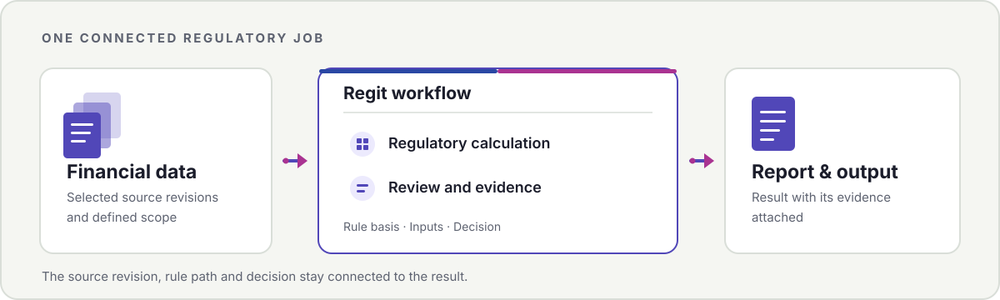

<!-- SPDX-License-Identifier: LicenseRef-Proprietary
SPDX-FileCopyrightText: 2026 Regit.io -->

**Regulatory infrastructure**

# Get the regulatory job done.

Connect financial data, execute regulatory calculations, and produce reports with evidence attached.

[Discuss your workflow](https://www.regit.io/contact?purpose=walkthrough) · [See how it works](https://www.regit.io/#platform)

<picture>
  <source media="(prefers-color-scheme: dark)" srcset="assets/workflow-dark.svg">
  
</picture>

Source revisions, rules and decisions stay linked to the work they support, so teams can understand a result and act on it without reconstructing its history.

## Ways to work

- [Workspace](https://www.regit.io/platform/for-people/): prepare and review work with its evidence in view.
- [API and CLI](https://www.regit.io/platform/for-systems/): connect systems and run defined operations.
- [MCP and A2A](https://www.regit.io/platform/for-agents/): bring scoped operations into agent workflows.

## Open-source Rust libraries

We publish reusable financial models, calculation conventions and identifiers. We also publish `regit-web3`, a set of Web3 primitives from our exploration of how the same operating model could support another domain. The libraries are separate from Regit's governed platform and do not, by themselves, produce a regulatory determination.

| Library | What it provides | Release | Crate downloads |
| :--- | :--- | :--- | :--- |
| [regit-svi](https://github.com/org-regit-io/regit-svi) | Volatility smiles, surfaces and calibration |  |  |
| [regit-blackscholes](https://github.com/org-regit-io/regit-blackscholes) | Options pricing, Greeks and implied volatility |  |  |
| [regit-covariance](https://github.com/org-regit-io/regit-covariance) | Covariance denoising, shrinkage and detoning |  |  |
| [regit-curves](https://github.com/org-regit-io/regit-curves) | Yield-curve construction and interpolation |  |  |
| [regit-daycount](https://github.com/org-regit-io/regit-daycount) | Day-count fractions and business-day calendars |  |  |
| [regit-identifiers](https://github.com/org-regit-io/regit-identifiers) | Securities, entity and market identifier validation |  |  |
| [regit-web3](https://github.com/org-regit-io/regit-web3) | Chain and provider reads, swap quotes and transaction preparation |  |  |

These live badges show crates.io releases and total crate downloads, not unique users. See each repository for its current implementation details.

For the thinking behind the Web3 work, read [Testing Regit across new domains with the same operating model](https://www.regit.io/resources/news-insights/testing-regit-across-new-domains-operating-model/). Explore all published libraries on our [open-source page](https://www.regit.io/resources/open-source/).

---

Regit is based in Luxembourg. [Discuss a workflow](https://www.regit.io/contact/) or [contact us by email](mailto:info@regit.io).
